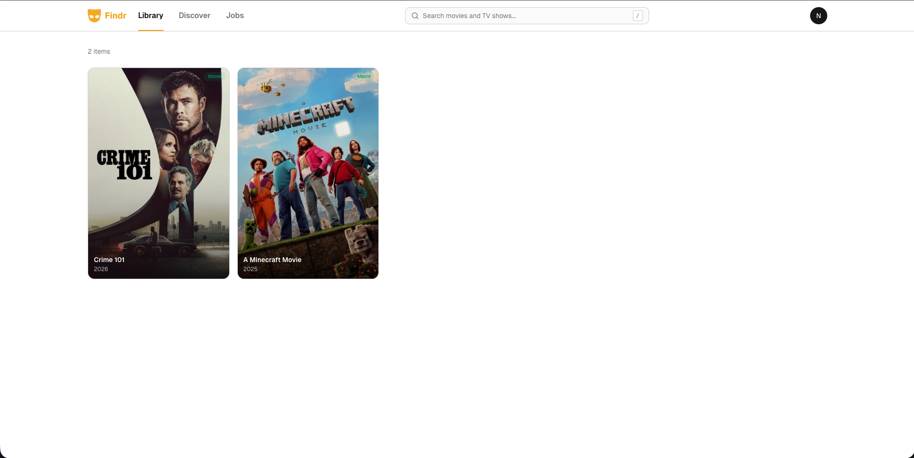
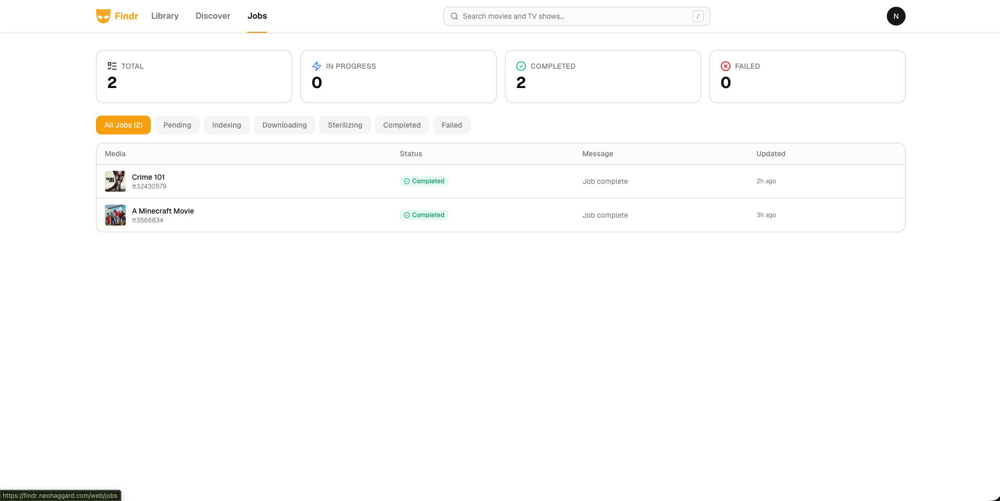

<div align="center">
  
  <h1>Find Anything.</h1>
  <h4>Automatic media acquisition tool for the Bittorrent network.</h4>
</div>


## What is this?
Rusty-Findr is an automated torrent indexer and downloader for movies and tv shows based on the original [Findr](https://github.com/Benzo-Fury/Findr) but written in Rust 🦀.

It uses the [Bittorrent](https://en.wikipedia.org/wiki/BitTorrent) network to download movies and tv series that have been uploaded by other users.

It automates the entire process of finding torrents, downloading them, sterilizing the files, and saving them to a specified output directory.

## Features
- Auto find and pick torrents using a score based algorithm.
- Smart torrent filtering with customizable scoring weights (resolution, codec, seeders, file size, release type, release group).
- Jackett integration for searching across all your configured indexers from one place.
- Plex and Jellyfin support with compatible file organization and automatic library rescans.
- Built-in web UI for managing jobs, with authentication and an admin dashboard.

<br>

<table>
  <tr>
    <td width="50%"></td>
    <td width="50%"></td>
  </tr>
  <tr>
    <td width="50%"></td>
    <td width="50%"></td>
  </tr>
</table>

<br>

## Installation

> [!NOTE]
> Ensure you have the [prerequisites](#prerequisites) running before starting.

Pre-compiled binaries are available on the [releases page](../../releases) for macOS, Linux, and Windows. Each release ships a single self-contained executable with no additional files required.

| OS | Architecture | File |
|---|---|---|
| macOS (Apple Silicon) | arm64 | `rusty-findr-aarch64-apple-darwin` |
| macOS (Intel) | x86_64 | `rusty-findr-x86_64-apple-darwin` |
| Linux | x86_64 | `rusty-findr-x86_64-unknown-linux-musl` |
| Windows | x86_64 | `rusty-findr-x86_64-pc-windows-msvc.exe` |


On macOS and Linux, mark the binary as executable after downloading, then run it.

```sh
chmod +x rusty-findr-*
./rusty-findr-*
```

On Windows, run the `.exe` directly with no extra steps.

On first run, a default config file is written to the [platform config path](#configuration). The process exits and prompts you to fill in your settings before re-running.

## Prerequisites

| Service | Purpose | Setup |
|---|---|---|
| PostgreSQL | Job and library database | Create a database named `rusty-findr` and set the connection URL in config |
| qBittorrent | Torrent downloading | Enable the Web UI under Tools > Preferences > Web UI |
| Jackett | Torrent indexer aggregation | Add your indexers, then copy the API key from the dashboard |
| TMDB | Metadata and artwork | Generate a free API key at [themoviedb.org](https://www.themoviedb.org/settings/api) |

## Configuration

On first run, a config file is written to the platform default location:

| Platform | Path |
|---|---|
| macOS | `~/Library/Application Support/rusty-findr/config.toml` |
| Linux | `~/.config/rusty-findr/config.toml` |
| Custom | Set the `CONFIG_LOCATION` environment variable to any absolute path |

The sections that require your own values are:

```toml
[server]
port = 3030
base_url = "http://localhost:3030"     # public URL used for auth callbacks
trusted_origins = ["http://localhost:5173"]

[auth]
secret = ""                             # at least 32 characters

[paths]
logs     = "/path/to/logs"
download = "/path/to/downloads"        # temporary; Findr clears this regularly
movies   = "/path/to/media/movies"
series   = "/path/to/media/series"

[database]
url = "postgres://localhost/rusty-findr"

[qbittorrent]
url      = "http://localhost:8080"
username = "admin"
password = "adminadmin"

[jackett]
url     = "http://localhost:9117"
api_key = ""                            # Settings > API Key in Jackett

[tmdb]
api_key = ""
```

All other sections (`[jobs]`, `[jobs.scoring]`, `[naming]`) have sensible defaults and do not need to be changed to get started.

File and folder naming supports the following placeholders: `{title}`, `{year}`, `{season}`, `{episode}`.


## Plex / Jellyfin

Rusty-Findr saves finished media to the `movies` and `series` paths set in your config. Point your Plex or Jellyfin library at those same directories and it will pick up new content automatically.

The default naming templates produce library-compatible names out of the box:

| Media | Folder | File |
|---|---|---|
| Movie | `The Dark Knight (2008)` | `The Dark Knight (2008).mkv` |
| TV show | `Breaking Bad (2008) / Season 1` | `Breaking Bad - S01E01.mkv` |

<!-- Planned: Once a job completes, Rusty-Findr can trigger a library rescan automatically. Set the URL of your Plex or Jellyfin instance in the config and it will notify the server without any manual intervention. -->

## Inspiration & Credit
This project was inspired by [Roundup](https://github.com/0xlunar/roundup), a similar tool created by a friend.
